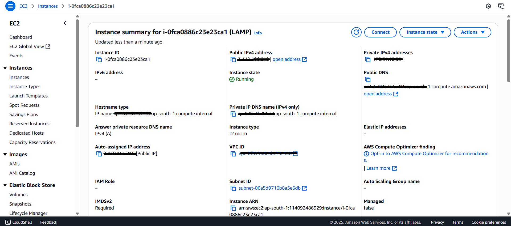
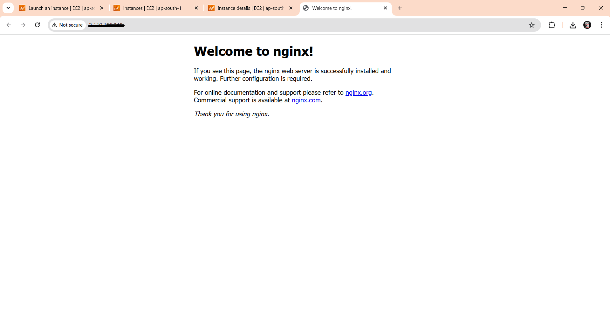

# AWS EC2 WordPress Hosting with Nginx

## 🎯 Objective
Set up a secure and fast WordPress site using AWS EC2, Nginx, PHP, and MariaDB.

## 🛠️ Tools Used
- AWS EC2 (Ubuntu 22.04)
- Nginx
- MariaDB Server
- PHP 8.1
- WordPress
- SSH (PuTTY/terminal)

## 🔧 What I Did
- Launched EC2 and connected with key
- Installed LEMP stack
- Created WordPress database and user
- Configured virtual host in Nginx
- Verified PHP and WordPress setup

## 📸 Screenshots

## 📄 Commands Used
Stored in `commands-used.sh` file for reference.

## 🧠 Skills Gained
- EC2 launching and SSH key handling
- LEMP configuration and debugging
- WordPress server-side hosting
